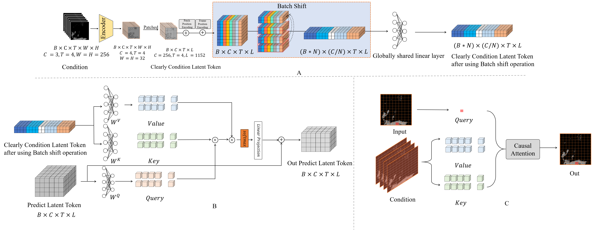

# Precipitation Nowcasting Using Diffusion Transformer with Causal Attention


Short-term precipitation forecasting remains chal- lenging due to the difficulty in capturing long-term spatiotem- poral dependencies. Current deep learning methods fall short in establishing effective dependencies between conditions and forecast results, while also lacking interpretability. To address this issue, we propose a Precipitation Nowcasting Using Diffusion Transformer with Causal Attention model. Our model leverages Transformer and combines causal attention mechanisms to es- tablish spatiotemporal queries between conditional information (causes) and forecast results (results). This design enables the model to effectively capture long-term dependencies, allowing forecast results to maintain strong causal relationships with input conditions over a wide range of time and space. We explore four variants of spatiotemporal information interactions for DTCA, demonstrating that global spatiotemporal labeling interactions yield the best performance. In addition, we intro- duce a Channel-To-Batch shift operation to further enhance the model’s ability to represent complex rainfall dynamics.




## How to use?
We provide a simple sampling interface, Pre-trained weights can be obtained from this address  https://drive.google.com/drive/folders/11H4llqi_ybAE-9WRQTwmyyXnxHN2HXLD?usp=drive_link

```
python sample.py
```

## To Do

- [ ] Provide clean training code
- [x] Provide clean sampling code
- [ ] Provide operating environment

